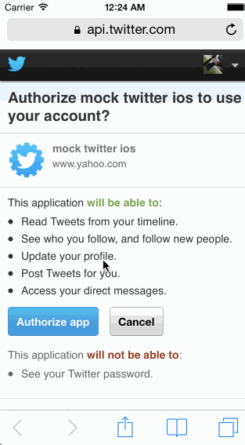
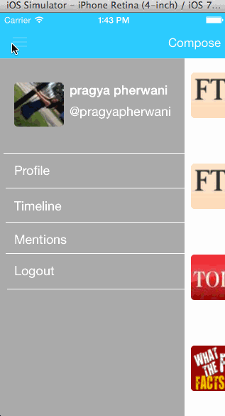

User Stories:

Hour spent: 25+ hours

* [x] User can sign in using OAuth login flow
* [x] User can view last 20 tweets from their home timeline
* [x] The current signed in user will be persisted across restarts
* [x] In the home timeline, user can view tweet with the user profile picture, username, tweet text, and timestamp.  In other words, design the custom cell with the proper Auto Layout settings.  You will also need to augment the model classes.
* [x] User can pull to refresh
* [x] User can compose a new tweet by tapping on a compose button.
* [x] User can tap on a tweet to view it, with controls to retweet, favorite, and reply.

Walkthrough of all user stories:

Twitter Redux: 12 hours (Completed all required stories)

* [x] Hamburger menu
    * [x] Dragging anywhere in the view should reveal the menu.
    * [x] The menu should include links to your profile, the home timeline, and the mentions view.
    * [x] The menu can look similar to the LinkedIn menu below or feel free to take liberty with the UI.
* [x] Profile page
    * [x] Contains the user header view
    * [x] Contains a section with the users basic stats: # tweets, # following, # followers
* [x] Home Timeline
    * [x] Tapping on a user image should bring up that user's profile page
    

Walkthrough of all user stories:

Resources used:
http://www.raywenderlich.com/32054/how-to-create-a-slide-out-navigation-like-facebook-and-path
